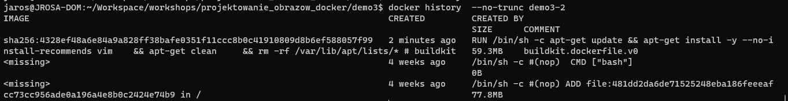

# Demo 3

Komendy wykonujemy w folderze `demo3`

## Budowanie obrazów do weryfikacji

```
docker build -f Dockerfile1 -t demo3-1 .
docker build -f Dockerfile2 -t demo3-2 .
```

### Screeny z analizy zbudowanych obrazów

#### demo3-1

`docker history`


`dive`


#### demo3-2

`docker history`



`dive`

